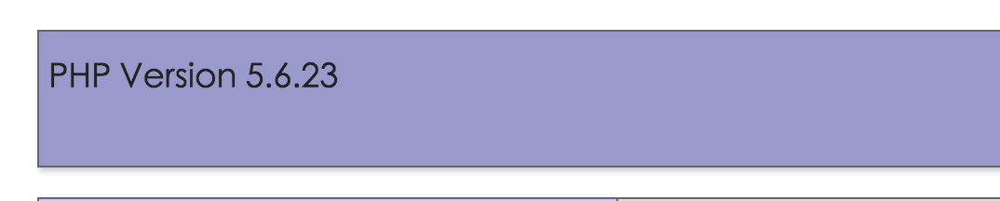

						Mac下PHP版本升级问题
	
	小弟前段时间刚入手一个Mbp，感觉十分不错，嘻嘻！
	尤其是从事web开发工作的。但是mac下自带php版本很低，
	完全无法赶上时代的潮流，尤其是php7发布。
	所以迫不得已想要去升级php版本。
	
	由于本人比较偷懒，在这边就介绍一种最简单的方式。
	总所周知在mac下php开发都是php+php-fpm方式来进行的，
	简单的方式就是通过homebrew来进行管理，推荐。
	我是打算安装php56的，所以直接
	
	brew install php56 
	然后等php安装完成，然后可以安装一个神器，真的神器，
	php-version 进行php版本管理。同样也是通过
	brew install php-version
	等待安装，然后可以执行
	source $(brew --prefix php-version)/php-version.sh
	就讲php-version添加到全局变量中去了，
	执行php-version会返回php的版本信息
	如果打开终端只有就能执行php-version 可以在 ~/.zshrc中添加
	source $(brew --prefix php-version)/php-version.sh
	然后就是切换版本了，
	php-version 5.6.23 #这是我的
	
	然后打开本地就可以查看了 哈哈
	
	
	